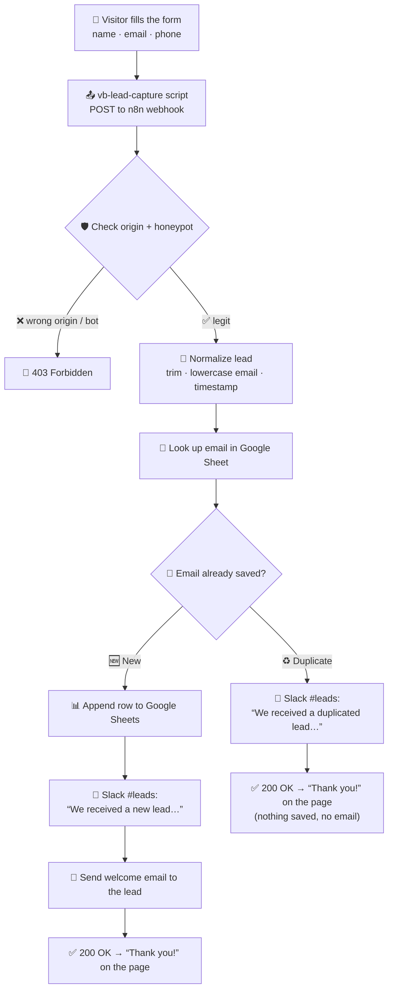

<h1 align="center">🏡 Vanessa Bennett — Luxury Realtor Landing Page</h1>

<p align="center">
  A static landing page with a <b>fully automated lead‑capture pipeline</b>.<br>
  Someone fills the form → the lead is validated, de‑duplicated, saved, and the team is notified — in seconds, with zero backend to maintain.
</p>

<p align="center">
  🌐 <b>Live site:</b> <a href="https://jose-automates.github.io/Realtor-Landing-Page/">jose-automates.github.io/Realtor-Landing-Page</a>
</p>

---

## ✨ What this repo is

| | |
|---|---|
| 📄 **Front‑end** | A static export of a WordPress/Elementor landing page. No server, no PHP, no database — just HTML/CSS/JS served by **GitHub Pages**. |
| 🤖 **Back‑end** | There isn't one. All the "backend" work (validation, storage, notifications, emails) runs in an **n8n workflow** triggered by a webhook. |
| 🔌 **The glue** | A small `<script>` injected into `index.html` that intercepts the form submit and POSTs the data to the n8n webhook. |

---

## 🔄 The lead‑capture flow



### Step by step

| # | Step | What happens |
|---|------|--------------|
| 1️⃣ | **Submit** | The `vb-lead-capture` script catches the form submit, stops Elementor's dead handler, and sends `name`, `email`, `phone` + a hidden honeypot field as a simple `POST`. |
| 2️⃣ | **Gatekeeping** 🛡️ | n8n checks the request comes from the real site (`Origin` header) **and** the honeypot is empty. Bots and off‑site calls get a `403`. |
| 3️⃣ | **Normalize** 🧹 | Name trimmed, email lower‑cased & trimmed, capture timestamp added, source tagged `Landing Page Vanessa Bennett`. |
| 4️⃣ | **De‑duplicate** 🔎 | The email is checked against every row already in the sheet (case‑insensitive). |
| 5️⃣a | **New lead** 🆕 | Row appended to Google Sheets → Slack message *"We received a new lead…"* → automated welcome email sent to the lead. |
| 5️⃣b | **Duplicate** ♻️ | **Nothing is saved and no email is sent.** Slack still gets a *"We received a duplicated lead…"* message so the team knows the person came back. |
| 6️⃣ | **Respond** ✅ | Either way the visitor sees *"Thank you, {name}! We received your details and will be in touch shortly."* |

---

## 🧩 Tech stack

| Piece | Role | Where |
|------|------|-------|
| 🐙 **GitHub Pages** | Hosts the static site | this repo, branch `main` |
| ⚙️ **n8n** | Runs the automation workflow (webhook → logic → integrations) | self‑hosted |
| 📊 **Google Sheets** | Source of truth for every lead (`Realtor Leads` → tab `leads`) | columns: `fecha_captura · nombre · email · telefono · fuente` |
| 💬 **Slack** | Real‑time team notifications | channel `#leads` |
| 📧 **Gmail** | Automated welcome email to the lead | — |

**n8n workflow:** `Vanessa Bennett` — 12 nodes, with automatic retries (3×) on every external call (Sheets, Slack, Gmail).

---

## 📁 Repo structure

```
├── index.html                ← the landing page (+ injected vb-lead-capture script)
├── wp-content/ · wp-includes/ ← CSS, JS, fonts and images (WordPress export)
├── .nojekyll                 ← tells GitHub Pages to serve files as‑is
└── wp-sitemap*.xml           ← sitemap files from the export
```

> 💡 The lead‑capture logic lives in a single `<script id="vb-lead-capture">` block near the bottom of `index.html`.

---

## 🛠️ Editing the site

It's plain static HTML — edit and push:

```bash
git add index.html
git commit -m "Update landing page copy"
git push origin main
```

GitHub Pages redeploys automatically in ~30 seconds.

### ⚠️ If you ever re‑export the site from WordPress

The `vb-lead-capture` script is **not** part of the WordPress design — it's injected here. After a fresh export you must re‑add it (a `<script id="vb-lead-capture">` before `</body>` in `index.html`) or the form will stop capturing leads.

---

## 📮 Contact form

The form is **not** connected to WordPress, Formspree or Netlify. It talks directly to the n8n webhook via the injected script. To point it somewhere else, change the `ENDPOINT` constant inside the `vb-lead-capture` script.

---

## 🎨 Fonts used

Poppins · Open Sans · Playfair Display · Inter · Libre Baskerville · Roboto — all loaded from Google Fonts.
